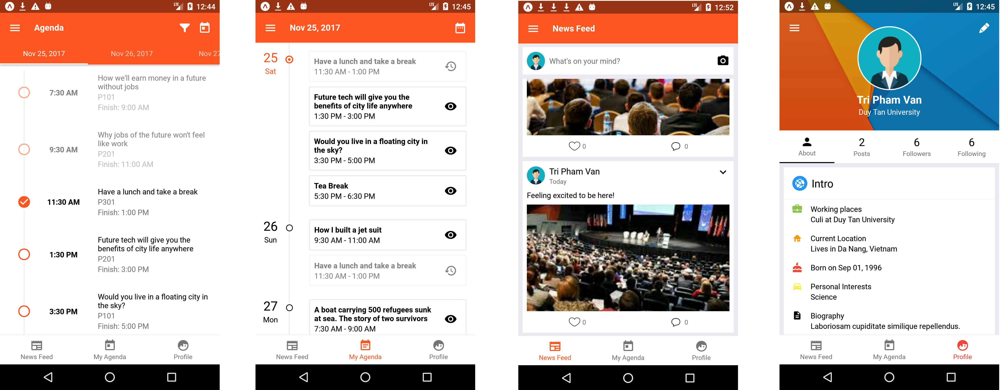

# ACM-client

Client Project for ACM build with Expo, React-native, Redux & Apollo.

## Showcases



## Releases

* Expo: https://expo.io/@pvtri96/acm

## Instruction

* Clone the project:

```
git clone https://github.com/sunway-official/acm-client
```

* Install dependencies

```
npm install
```

* Start packager

```
npm start
```

## Documents

* Start the packager: `npm start`
* Start the packager for android: `npm run android`
* Start the packager for ios: `npm run ios`
* Test: `npm run test`
* Lint: `npm run lint`

## Development & Deployment

* Expo: https://expo.io
* React-native Debugger:
  https://github.com/jhen0409/react-native-debugger/releases

## Contributers

* Pham Van Tri
* Le Thi Thuy Dung
* Ly Bao Khanh

## More information

* ACM-server: https://github.com/sunway-official/acm-server
* ACM-admin: https://github.com/sunway-official/acm-admin
